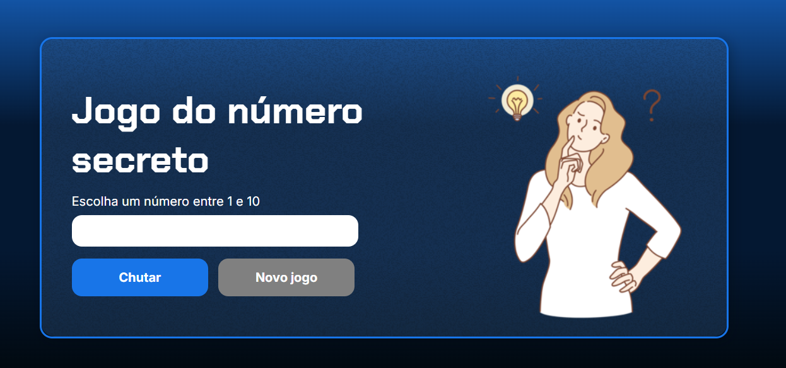

<h1>Jogo do número secreto</h1>

<h2>Sobre</h2>

Projeto utilizado nos cursos de lógica  de programação da Alura. O jogo consiste na ideia de acertar um número aleatório por meio de tentativas de chute. A cada tentativa, o jogo informa se o chute dado é maior ou menor que o número secreto, ou se corresponde ao número. No final, ao acertar o número, o jogo informa em quantas tentativas isso aconteceu.

## Tecnologias

<h2>Visualização inicial da página: </h2>

  

